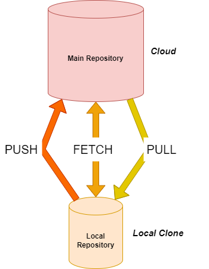

# fit Omicron - C# Basics 
starting with C#
- C# Basics
- GIT Basics
- UML Basics

To learn more about Markdown syntax please click [HERE](https://www.markdownguide.org/basic-syntax/)!

*This* is a very **important** part.

## GIT Basics

